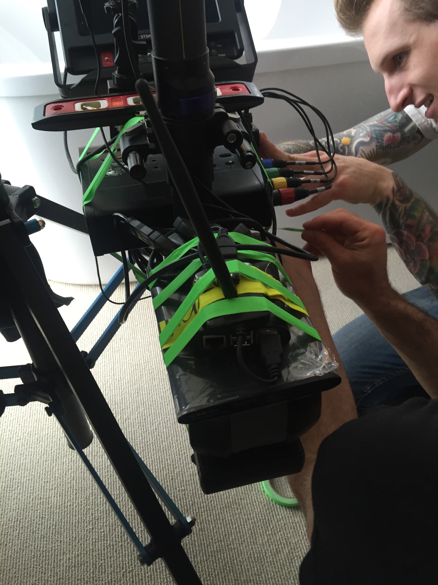
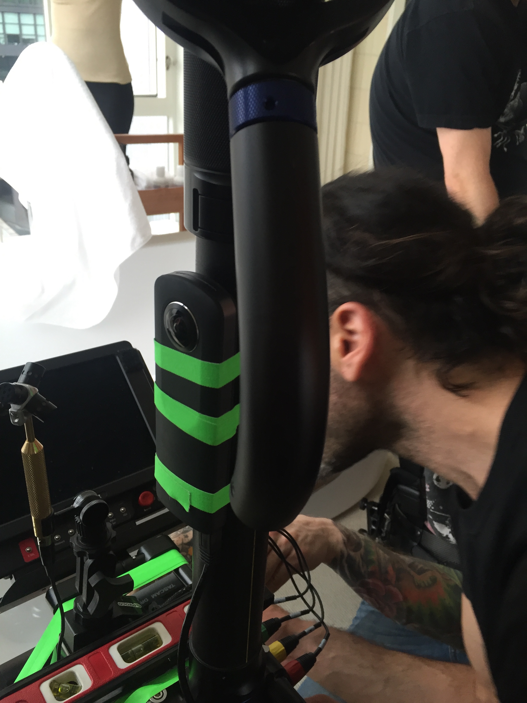

# VR Theta viewer

This is a group of tools and code for using a Ricoh Theta S with a Raspberry Pi for serving a VR preview to multiple users simultaneously on mobile devices.

This was built out of the need to be able to preview VR shots during production, as most camera systems (GoPro, Jaunt, etc) don't currently have a way to do a live preview of what's being shot, especially not in a way that is untethered.  The Theta itself will allow a single connection using its app, but there is no control over compression, its battery doesn't last long, it only allows one connection, and the strength of its signal is a little weak and doesn't work well through walls.  For VR production we will tape or velcro this system somewhere on the camera or tripod and hang the battery/pi bundle underneath.

This system can be attached to a camera's tripod and will run for 7 or 8 hours on the battery I have listed.  In a future configuration, a battery cartridge system will be fabricated with a power backplane of some kind which will allow hot swapping batteries.

If you choose to build something like this, it's really important to consider power requirements... the specific order and configuration of usb plugs is important.  The wireless antenna will work much better if it is powered through a hub or split power USB cable.  The Pi will not pass a large charge, so both the theta and WiFi antenna will need additional power for production use.







## Miniumum Requirements:

* Ricoh Theta S
* Raspberry Pi with probably an 8GB disk, maybe smaller, depending on how you install things.  Bigger is easier... don't forget the extend disk step!
* USB A to Micro B cable (and similar), with power split: http://www.amazon.com/StarTech-3-Feet-Cable-External-Drive/dp/B0047AALS0/ref=pd_sim_147_3?ie=UTF8&dpID=41phEjqn%2BWL&dpSrc=sims&preST=_AC_UL320_SR320%2C320_&refRID=0GBYVGGE6V4AB8KNP9VK
* Powered USB3 Hub (depending on how you cable things)

## For wireless, which is the whole point!:

* 802.11N USB WiFi antenna
* Powerful battery!  I've had success with the POLANFO M50000 @ 20000 mAh
* A handful of other cable/hub things, like a squid hub: http://www.staples.com/Insten-4-Port-Octopus-USB-Hub-Black/product_970854?cid=PS:GooglePLAs:970854&ci_src=17588969&ci_sku=970854&KPID=970854&lsft=cid:PS-_-GooglePLAs-_-970854,kpid:970854,adtype:pla,channel:online&gclid=CjwKEAjw0KK4BRDCiKHD5Ny8pHESJACLE620w0RNoWGYftIR8jsCYg1djOVmyvhqfJvWJEBeFY1XbBoCq2jw_wcB

## In practice, it's a little uncomfortable while developing:

You will want to access the pi directly for coding, compiling, scripting, etc... but if the Pi is the WAP, internet connection is not so easy.  Either the Pi acts as a pass-thru for internet, or you reconfigure your laptop...

You will want the Pi to connect to the internet at times so that libraries can be downloaded... But you will also want to test the system in a production state, which assumes no internet at all.  After going through many configurations, the simplest way for me turned out to be using my phone as a tether device with bluetooth on my laptop... The non-obvious thing was that I had to go into the OSX network settings on my laptop and set bluetooth internet above wifi... things got much easier after that!

## Please note:

The OrbitControls.js file was tweaked to make this work...  It's not the standard one that is distributed with three.js.

## Install

0. place this repo at /var/www/html

   You can put it wherever you want, but the webserver will want to access the /html folder and the /application/proxy2.php file.  If you put it in a different place, some re-pathing will be needed throughout.

   Part of this design is to remove the CORS requirements for browsers because of the way mjpg-streamer works... the intention in production use is for this to be viewed through multiple mobile devices while on set shooting, but in practice, viewing it on a laptop during development is more comfortable... depending on browser, complications may exist... safari, chrome, etc... all are a little different.

1. build mjpg-streamer, which will pull frames from the camera and create a multipart/x-mixed-replace http stream

   you will need a variety of libraries for this... most or all of which are loaded by cmake:

   ```bash
cd mjpg/mjpg-streamer3/mjpg-streamer/mjpg-streamer-experimental
cmake
make
```


2. build the proxy app, which will stream to shared memory and recompress frames...

   you will need qt (5.3+?) installed via yum...

   ```bash
cd application/proxy.qt
qmake
make
```

   if you want to change compression or sizing, those values are hard coded into proxy.cpp


3. Install php, which will serve the proxied image stream to multiple clients via apache2

   To just load the image stream:
   http://[raspi]/application/proxy2.php

   To load the VR interface:
   http://[raspi]/


4. Softlink the daemon process so it will start on reboot, and add it as a service

   ```bash
sudo ln -s /var/www/html/application/thetaServer /etc/init.d/
sudo update-rc.d thetaServer defaults
service thetaServer start
```


This whole system is very much still in development... but I know that other people are trying to solve the same problem...

I give props to:
* https://hackaday.io/project/5077-metaverse-lab/log/30947-ricoh-theta-s-360-streaming
* http://jacobsalmela.com/raspberry-pi-webcam-using-mjpg-streamer-over-internet/
* https://hackaday.io/project/5077-metaverse-lab/log/17307-avalon-pt-2

there are many more pages on the web that were helpful... will include them as I go.


